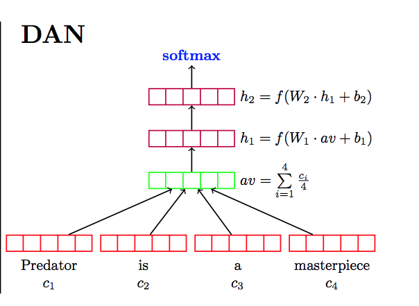

# Tweets Disaster Detection by DAN

<!-- TABLE OF CONTENTS -->

  
Table of Contents

  <ol>
    <li>
      <a href="#about-the-project">About The Project</a>
      <ul>
        <li><a href="#what-is-DAN">What is DAN?</a></li>
      </ul>
    </li>
    <li>
      <a href="#getting-started">Getting Started</a>
      <ul>
        <li><a href="#prerequisites">Prerequisites</a></li>
        <li><a href="#installation">Installation</a></li>
      </ul>
    </li>
    <li><a href="#usage-and-result">Usage and Result</a></li>
    <li><a href="#contributor">Contributor</a></li>

  </ol>

## About The Project
The goal of this project is to classify disaster related tweets by implenmenting Deep Average Neural Network with PyTorch. The dataset is from a [Kaggle compitition](https://www.kaggle.com/c/nlp-getting-started/overview). 

### What is DAN?
 
 

DAN stands for Deep Averaging Network. It is a simple Neural Network that learns the compositionality of the inputs. The architecture of DAN looks like the picture above. First of all, it take the vector average of the input embeddings, then pass it through 1 or more feed-forward layers. Intuition being that each layer will increasingly magnify small but meaningful differences in the word embedding average. Fianlly, perform Linear classification on final layer.

## Getting Started

### Prerequisites

### Installation

## Usage and result
