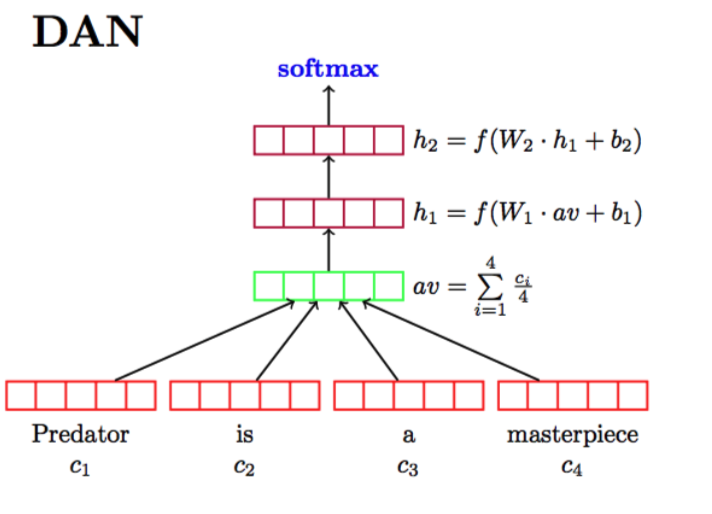
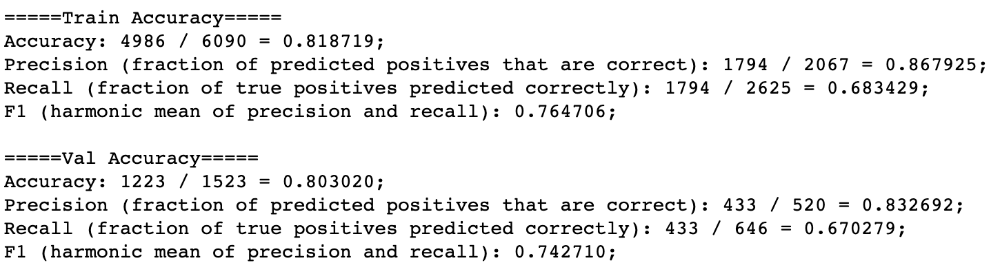

# Tweets Disaster Detection by DAN


<!-- TABLE OF CONTENTS -->
<details open="open">
  <summary>Table of Contents</summary>
  <ol>
    <li>
      <a href="#about-the-project">About The Project</a>
      <ul>
        <li><a href="#what-is-DAN">What is DAN?</a></li>
      </ul>
      <ul>
        <li><a href="#method">Method</a></li>
      </ul>
      <ul>
         <li><a href="#further-steps">Further Steps</a></li>
       </ul>
    </li>
    <li>
      <a href="#getting-started">Getting Started</a>
      <ul>
        <li><a href="#prerequisites">Prerequisites</a></li>
        <li><a href="#installation">Installation</a></li>
      </ul>
    </li>
    <li><a href="#usage-and-result">Usage and Result</a></li>
    <li><a href="#contributor">Contributor</a></li>

  </ol>
</details>

## About The Project
The goal of this project is to classify disaster related tweets by implenmenting Feed-Forward Neural Network, mainly Deep Average Neural Network with PyTorch. The dataset is from a [Kaggle compitition](https://www.kaggle.com/c/nlp-getting-started/overview). The dataset have 7,613 datapoints in traing set with 3,271 real disaster tweets and 4,342 normal tweets. The dataset includes two column:
  - context of tweets (string)  
  - disaster or not (boolean)  

In this notebook, we built a model that predicts which Tweets are about real disasters and which one’s are not. We hope the result can help with deliver reliable information of emergency.

### What is DAN?
 
 <p align="center"></p>

DAN stands for Deep Averaging Network. It is a simple Neural Network that learns the compositionality of the inputs. The architecture of DAN looks like the picture above. First of all, it take the vector average of the input word embeddings, then pass it through 1 or more feed-forward layers. Intuition being that each layer will increasingly magnify small but meaningful differences in the word embedding average. Fianlly, perform Linear classification on final layer. Despite its simplicity, DAN outperforms many other more sophisticated models which are designed to explicitly learn the compositionality of texts. For example, DAN outperforms syntactic models on datasets with high syntactic variance. So we first devoted our efforts mainly trying this architecture.


### Method

After checking there is no imbalance issue, we did some preprocessing and feature engineering, getting the words from twitter text into clear and normalized format. For word representation, we used pretrained embeddings (Stanford GloVe) instead of word2vec model consideing that the dataset is relatively small. By doing this, we can exploit some transfer learning from the pretrained embeddings. As for model building, we created a 3-layer Deep Averaging Neural Network. It views text as a bag of words and takes the average of the word embeddings as the representation of the twitter text. 

### Further steps

We think that there are still a lot of methods to solve this problem. For example, we want to try deeper neural network with current model.  It may need more computational resource, and increasing the number of hidden layers might improve the accuracy or might not, it depends on the complexity of the problem, but it still worth a try. Or we can also try RNN/CNN-based model like GRU or LSTM. Another possible better solution is to create text features with bag-of-ngrams. Bag of n-grams can be more informative than bag of words because they capture more context around each word. Finally, we can try other pretrained embeddings like standford twitter glove or directly exploit pretained models like BERT.

## Getting Started

### Prerequisites

In this project, we need to use Pandas, Numpy, and PyTorch with Python 3.5.0 or greater.


### Installation

* Pytorch
  ```sh
  pip3 install torch torchvision
  ```

## Usage and result
 <p align="center"></p>

## Contributor

[Min Che](https://www.linkedin.com/in/min-che/)

[Eileen Wang](https://www.linkedin.com/in/eileen-wang-ba8048159/) 
